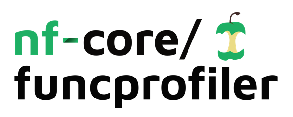

<h1>
  <picture>
    <source media="(prefers-color-scheme: dark)" srcset="docs/images/nf-core-funcprofiler_logo_dark.png">
    
  </picture>
</h1>

[](https://github.com/nf-core/funcprofiler/actions/workflows/nf-test.yml)
[](https://github.com/nf-core/funcprofiler/actions/workflows/linting.yml)[](https://nf-co.re/funcprofiler/results)[](https://doi.org/10.5281/zenodo.XXXXXXX)
[](https://www.nf-test.com)

[](https://www.nextflow.io/)
[](https://github.com/nf-core/tools/releases/tag/3.3.2)
[](https://docs.conda.io/en/latest/)
[](https://www.docker.com/)
[](https://sylabs.io/docs/)
[](https://cloud.seqera.io/launch?pipeline=https://github.com/nf-core/funcprofiler)

[](https://nfcore.slack.com/channels/funcprofiler)[](https://bsky.app/profile/nf-co.re)[](https://mstdn.science/@nf_core)[](https://www.youtube.com/c/nf-core)

## Introduction

<!-- TODO nf-core: Include a figure that guides the user through the major workflow steps. Many nf-core
     workflows use the "tube map" design for that. See https://nf-co.re/docs/guidelines/graphic_design/workflow_diagrams#examples for examples.   -->

**nf-core/funcprofiler** is a bioinformatics pipeline for read-based functional profiling of microbiome sequencing data. It accepts short-read (Illumina) and long-read (Oxford Nanopore) FASTQ files and runs one or more functional profilers against user-supplied databases, producing gene family abundances, pathway abundances, pathway coverages, and antimicrobial resistance profiles.

Supported profilers:

1. [**HUMANn v3**](https://huttenhower.sph.harvard.edu/humann/) — functional profiling via MetaPhlAn + HUMANn 3 (`--run_humann_v3`)
2. [**HUMANn v4**](https://huttenhower.sph.harvard.edu/humann/) — functional profiling via MetaPhlAn + HUMANn 4 (`--run_humann_v4`)
3. [**FMH FunProfiler**](https://github.com/dib-lab/fmh_funprofiler) — sketch-based functional profiling (`--run_fmhfunprofiler`)
4. **RGI** — antimicrobial resistance gene identification (`--run_rgi`, work in progress)
5. **mifaser** — functional profiling via mifaser (`--run_mifaser`, available)
6. **DIAMOND** — alignment with DIAMOND blastx (`--run_diamond`, available)

## Usage

> [!NOTE]
> If you are new to Nextflow and nf-core, please refer to [this page](https://nf-co.re/docs/usage/installation) on how to set-up Nextflow. Make sure to [test your setup](https://nf-co.re/docs/usage/introduction#how-to-run-a-pipeline) with `-profile test` before running the workflow on actual data.

First, prepare a samplesheet with your input data:

`samplesheet.csv`:

```csv
sample,run_accession,instrument_platform,fastq_1,fastq_2,fasta
SAMPLE1,RUN1,ILLUMINA,/path/to/sample1_R1.fastq.gz,/path/to/sample1_R2.fastq.gz,
SAMPLE2,RUN1,OXFORD_NANOPORE,/path/to/sample2.fastq.gz,,
```

Each row represents a sequencing run. Multiple rows with the same `sample` and different `run_accession` values will be merged before profiling.

Then prepare a databases sheet — see [docs/usage.md](docs/usage.md) for the full format.

Now, you can run the pipeline using:

```bash
nextflow run nf-core/funcprofiler \
   -profile <docker/singularity/.../institute> \
   --input samplesheet.csv \
   --outdir <OUTDIR> \
   --databases databases.csv \
   --run_humann_v3
```

> [!WARNING]
> Please provide pipeline parameters via the CLI or Nextflow `-params-file` option. Custom config files including those provided by the `-c` Nextflow option can be used to provide any configuration _**except for parameters**_; see [docs](https://nf-co.re/docs/usage/getting_started/configuration#custom-configuration-files).

For more details and further functionality, please refer to the [usage documentation](https://nf-co.re/funcprofiler/usage) and the [parameter documentation](https://nf-co.re/funcprofiler/parameters).

## Pipeline output

To see the results of an example test run with a full size dataset refer to the [results](https://nf-co.re/funcprofiler/results) tab on the nf-core website pipeline page.
For more details about the output files and reports, please refer to the
[output documentation](https://nf-co.re/funcprofiler/output).

## Credits

nf-core/funcprofiler was originally written by Nick Waters.

We thank the following people for their extensive assistance in the development of this pipeline:

<!-- TODO nf-core: If applicable, make list of people who have also contributed -->

## Contributions and Support

If you would like to contribute to this pipeline, please see the [contributing guidelines](.github/CONTRIBUTING.md).

For further information or help, don't hesitate to get in touch on the [Slack `#funcprofiler` channel](https://nfcore.slack.com/channels/funcprofiler) (you can join with [this invite](https://nf-co.re/join/slack)).

## Citations

<!-- TODO nf-core: Add citation for pipeline after first release. Uncomment lines below and update Zenodo doi and badge at the top of this file. -->
<!-- If you use nf-core/funcprofiler for your analysis, please cite it using the following doi: [10.5281/zenodo.XXXXXX](https://doi.org/10.5281/zenodo.XXXXXX) -->

<!-- TODO nf-core: Add bibliography of tools and data used in your pipeline -->

An extensive list of references for the tools used by the pipeline can be found in the [`CITATIONS.md`](CITATIONS.md) file.

You can cite the `nf-core` publication as follows:

> **The nf-core framework for community-curated bioinformatics pipelines.**
>
> Philip Ewels, Alexander Peltzer, Sven Fillinger, Harshil Patel, Johannes Alneberg, Andreas Wilm, Maxime Ulysse Garcia, Paolo Di Tommaso & Sven Nahnsen.
>
> _Nat Biotechnol._ 2020 Feb 13. doi: [10.1038/s41587-020-0439-x](https://dx.doi.org/10.1038/s41587-020-0439-x).
